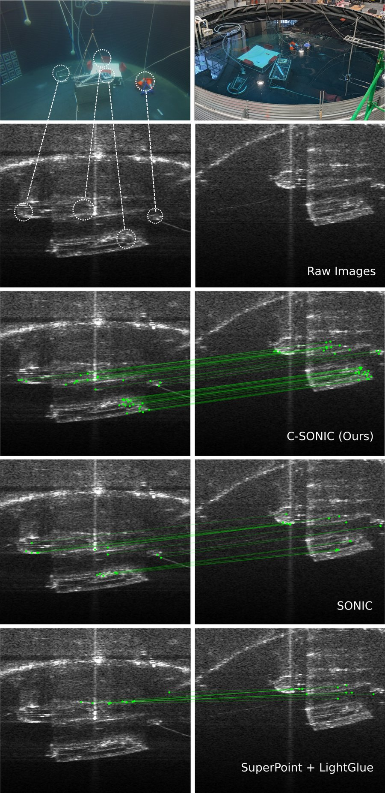
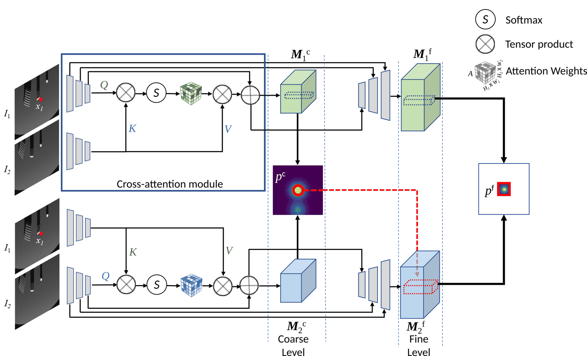

*Matches on real data from a test tank. The top row shows the tank. The left
column is the low frequency mode, and the right column is the high frequency
mode. The rows below the tank are the raw images, C-SONIC (ours), SONIC, and
SuperPoint + LightGlue. Each green line is one match.*

# C-SONIC: Cross-Sonar Image Correspondence for Generalized Feature Matching in Imaging Sonars

Chapter 6 of the PhD thesis *Underwater Localization and Mapping for
Cost-Effective Robots* by Akshay A. Hinduja, Carnegie Mellon University,
August 2024.

Collaborators: Samiran Gode, Michael Kaess (advisor)

paperurl: https://drive.google.com/file/d/139sImtH6CO3Z8pBr55cLVAKHRkygD6qI/view?usp=drive_link

## Abstract

Imaging sonars work in deep water, where turbidity limits a camera.
Particulates do not stop their long-range view. Their images change with the
settings of the sensor: the frequency mode, the range limits, and the binning
of the manufacturer. This variability makes correspondence between two settings
difficult. C-SONIC follows SONIC, which uses pose supervision to learn sonar
correspondence at one fixed setting. C-SONIC matches features across settings
and across sensors. A robot with a low-cost sonar can then localise in a map
from a robot with a higher frequency sonar. This work has two parts. The first
is a cross-sonar matching model for most of the Blueprint Subsea Oculus family,
with a framework that trains a new model on data from another imaging sonar.
The second is a dataset of 550000 image pairs with different frequency and
range settings. Each frame holds a pose and a metadata record.

## What is C-SONIC

C-SONIC finds point correspondences between two imaging sonar images, also
when the two images come from different frequency modes, range settings or
sensors. It learns from the pose of each image, so no labelled match is
necessary. An epipolar loss and a cycle consistency loss give the training
signal, and both read the geometry of each image from its own metadata. A
multi-head cross-attention module with rotary positional embeddings mixes the
layer-3 features of the two images. The refined map makes the coarse
descriptors and feeds the decoder of the fine descriptors, so each descriptor
knows both images of the pair. `--cross_attention 0` gives the SONIC baseline,
which encodes each image alone. The model trains on simulated Blueprint Subsea
M1200d images in both frequency modes.



*The cross-attention module at the encoder level. The layer-3 feature maps of
the two images attend to each other, and the residual sum feeds both the
coarse map (M^c) and the fine map (M^f).*

## Results

The percentage of inlier matches, from chapter 6 of the thesis.\*

| Method | Simulation, low variation | Simulation, high variation | Test tank |
| --- | --- | --- | --- |
| SuperPoint + LightGlue | 33.39 % | 12.39 % | 36.25 % |
| SONIC | 37.28 % | 28.77 % | 47.09 % |
| C-SONIC | 40.93 % | 31.76 % | 64.62 % |

Two-view acoustic bundle adjustment errors can be found in chapter 6 of the
thesis.

\* The numbers may not be exact. The training and validation pairs had to be
regenerated after a data loss.

## Installation

Install [uv](https://docs.astral.sh/uv/). Then run one of these commands in the
repository root:

```bash
uv sync                      # the core packages and pytest
uv sync --group train        # adds wandb, for training runs
uv sync --group notebook     # adds JupyterLab and ipympl, for the demo
```

Start every script with `uv run`. The repository is a flat research layout:
nothing is installed as a package, and the scripts run from the repository root.

Python 3.10 to 3.12 is necessary. The lock file pins torch 2.4.0 and torchvision
0.19.0 from PyPI. The PyPI wheel for Linux x86_64 bundles the CUDA 12.1 runtime,
so `uv sync` installs no CUDA toolkit. You still need an NVIDIA GPU that this
runtime supports, and a driver for it. macOS, Windows and Linux aarch64 resolve
different wheels with different GPU support. A machine with no GPU also works,
but read the CPU note in [Pretrained models](#pretrained-models) first.

To use a different CUDA build, add an index to `pyproject.toml` and point the
two packages at it:

```toml
# [[tool.uv.index]]
# name = "pytorch-cu118"
# url = "https://download.pytorch.org/whl/cu118"
# explicit = true
#
# [tool.uv.sources]
# torch = { index = "pytorch-cu118" }
# torchvision = { index = "pytorch-cu118" }
```

Then run `uv lock` and `uv sync` again.

## Pretrained models

Two weight files are necessary, and they come from two different places.
Download the C-SONIC checkpoint from the `pretrained` folder of the
[C-SONIC Drive folder](https://drive.google.com/drive/folders/1f3TUlXsOEbsliTGSbKlzKRXRGDREdaCy?usp=drive_link).
Download
`superpoint_v1.pth` from the Magic Leap repository,
<https://github.com/magicleap/SuperPointPretrainedNetwork>, and accept its
license there. This repository redistributes neither file. Put both in a
`pretrained/` folder in the repository root:

```
pretrained/
├── CSONIC_pretrained.pth    # the released C-SONIC model
└── superpoint_v1.pth        # the SuperPoint detector, for the query points
```

| file | md5 | note |
| --- | --- | --- |
| `CSONIC_pretrained.pth` | `d4bb195340df2cc3fd7c7f87595694de` | training step 160000 |
| `superpoint_v1.pth` | `938af9f432d327751dcbc0d6c7a0448b` | Magic Leap, noncommercial research only; see `THIRD_PARTY_NOTICES.md` |

The defaults in `config.py` are the settings that trained the released model.
`--superpoint_weights` points at `pretrained/superpoint_v1.pth` already. Give
the checkpoint with `--ckpt_path` to `train.py`, or with `--model` to
`CSONIC_test.py`.

CPU note: about half the weights of the released checkpoint are subnormal
floats. On a CPU, a forward pass with these weights takes about a minute
instead of about a second. `CSONICModel` in `CSONIC/csonic_model.py` sets these
weights to zero when it loads a checkpoint. Thus `CSONIC_test.py`, the notebook
and a resumed training run all get the fast weights. The file on disk does not
change. On the tested pairs, the matches stayed bit-identical. To keep the
stored values, set `zero_subnormal_weights` to `False` in
`CSONIC_test.load_model` or in `CSONICModel`.
If your own code loads the weights into `CSONICNet` directly, call
`zero_subnormal_weights` from `CSONIC/csonic_model.py` after `load_state_dict`.

## Data

Dataset: the [C-SONIC Drive folder](https://drive.google.com/drive/folders/1f3TUlXsOEbsliTGSbKlzKRXRGDREdaCy?usp=drive_link).
It holds the seven log zip files, the released checkpoint, the pair lists
(`csonic_pairs_v1`) and the demo sample (`csonic_sample_v1`).

The C-SONIC data is an addition to the SONIC data, not a replacement. The
training lists name the logs of both datasets, so a training run needs both:

1. Download the
   [SONIC dataset](https://drive.google.com/drive/folders/1ykFXI9AJjrRCmz7MvjdqdCq7e-4Hir-c).
   Extract its logs under `logs/` of your dataset root. These logs hold the
   `Metadata_<n>` folders that C-SONIC reads.
2. Download the seven zip files of the C-SONIC Drive folder. Extract each
   zip into the same `logs/` folder.
3. Copy these six lists from `csonic_pairs_v1` of the Drive folder into
   that `logs/` folder: `pairs.txt`, `pairs_pos.txt`,
   `pairs_meta.txt`, `pairs_val.txt`, `pairs_pos_val.txt` and
   `pairs_meta_val.txt`. The `*_cross*` files there hold the new pairs only;
   training does not read them.

The demo sample below needs no SONIC download.

### The pair files

A pair needs six files: an image, a pose and a metadata file on each side,
named by three parallel path patterns. Image `logs/<LOG>/Sonar_<n>/S_<f>.npy`
is a 512x512 `.npy` array, sonar `n`, frame `f`; the loader flips both axes.
Pose `logs/<LOG>/Pose_<n>/P_<f>.npy` is a 4x4 matrix, sensor to world, in
metres. Metadata `logs/<LOG>/Metadata_<n>/M_<f>.npy` is a Python dict, pickled
into a `.npy` file; read it with `np.load(path, allow_pickle=True).item()`. The
dict holds six keys:

| key | unit | meaning |
| --- | --- | --- |
| `width`, `height` | pixels | the image size |
| `r_min`, `r_max` | metres | the near and the far range |
| `elev` | degrees | the vertical field of view (elevation) |
| `azi` | degrees | the horizontal field of view (azimuth) |

For example, the high-frequency log `ELC2_BPH_1` of the released sample:
`{'width': 512, 'height': 512, 'r_min': 0.1, 'r_max': 10, 'elev': 12, 'azi': 60}`.

Three parallel text files list the pairs: `pairs.txt`, `pairs_pos.txt` and
`pairs_meta.txt`. Line n of the three lists describes the same pair. Each path
is relative to `--datadir`, or to `--val_data_dir` for validation when you set
it. An absolute path also works. Line 2 of the released sample:

```
logs/ELC2_BPH_1/Sonar_0/S_1005.npy    logs/ELC2_BPL_1/Sonar_0/S_1000.npy
logs/ELC2_BPH_1/Pose_0/P_1005.npy     logs/ELC2_BPL_1/Pose_0/P_1000.npy
logs/ELC2_BPH_1/Metadata_0/M_1005.npy logs/ELC2_BPL_1/Metadata_0/M_1000.npy
```

The loader scales the pixels to [0, 1], then subtracts `SONAR_MEAN` (0.052)
and divides by `SONAR_STD` (0.060), the values the released checkpoint trained
with.

### How the released lists were made

`make_pairs.py` keeps the SONIC lists and adds pairs from the seven C-SONIC
logs: two logs of one scene (uniform over the combinations, the same log
included), two random sonars, and a second frame 1 to 9 frames later, or 0 to
9 frames later when the two logs differ. `BPH` is high frequency, `BPL` is low
frequency, and `_LR` marks a long-range log. The `*_cross*` files hold the new
pairs only.

| split | SONIC lines | new lines | total |
| --- | --- | --- | --- |
| train | 294878 | 255122 | 550000 |
| validation | 32665 | 27578 | 60243 |

```bash
uv run python make_pairs.py --zips /path/to/logs-zip/*.zip \
    --sonic-dir /path/to/sonic-pairs --out /path/to/dataset/logs --verify
```

The lists of the original thesis run were lost; `make_pairs.py` rebuilds them
with the same rule and the same sizes, but not the same exact pairs. Run
`uv run python make_pairs.py --help` for the full list of options.

## Demo

### The notebook

```
pretrained/CSONIC_pretrained.pth
pretrained/superpoint_v1.pth
samples/csonic_sample/logs/     # csonic_sample_v1 from the C-SONIC Drive folder
```

```bash
uv sync --group notebook
uv run jupyter lab Jupyter/Visualizer.ipynb
```

Run both cells. Click a point in the left image; the predicted match appears
in the right image, inside a circle that shows the spread of the prediction.
Run the second cell again for another pair. Set `args.datadir` in the first
cell to use another dataset folder.

See [Jupyter/README.md](Jupyter/README.md) for the notebook layout, what the
sample holds, and how to make your own sample with `extract_sample.py`.

### The command line

```bash
uv run python CSONIC_test.py \
    --img1 samples/csonic_sample/logs/ELC2_BPH_1/Sonar_0/S_1005.npy \
    --img2 samples/csonic_sample/logs/ELC2_BPL_1/Sonar_0/S_1000.npy \
    --meta1 samples/csonic_sample/logs/ELC2_BPH_1/Metadata_0/M_1005.npy \
    --meta2 samples/csonic_sample/logs/ELC2_BPL_1/Metadata_0/M_1000.npy \
    --pose1 samples/csonic_sample/logs/ELC2_BPH_1/Pose_0/P_1005.npy \
    --pose2 samples/csonic_sample/logs/ELC2_BPL_1/Pose_0/P_1000.npy \
    --model pretrained/CSONIC_pretrained.pth \
    --ransac --out match.png
```

It prints the number of query points that each filter removes, the number of
matches and the elapsed time. It writes the match figure to `--out`. The two
poses are optional. With them, `--ransac` removes the matches that disagree
with the geometry, and the script prints the inlier percentage and the mean
pixel error.

* `--th` keeps only the sure matches.
* `--roi` keeps only the query points inside a box.
* `--min-intensity` removes the query points in dark areas, such as the water
  column, where there is no return to match. The filter removes a point when
  the mean of image 1 in a box around it is below 15, on a 0 to 255 scale. The
  filter is on by default. Set `--min-intensity 0` to turn it off.
* `--intensity-window` sets the side of that box in pixels, 15 by default. Use
  an odd number.
* `--visible-only` uses the two poses to remove the query points that sonar 2
  cannot see. It needs `--pose1` and `--pose2`. When image 1 has a wider view
  than image 2, many of its points have no match. This is why the examples put
  the high-frequency image, which has the narrower view, first. Use the flag
  for an evaluation or with a pose prior from odometry.
* `--bn` selects where batch normalisation takes its statistics from.
* `--legacy-input` reproduces the evaluation pipeline of the thesis. It also
  turns the brightness filter off, unless you set `--min-intensity`.

Run `uv run python CSONIC_test.py --help` for every flag.

`detection.py` shows the raw detections of one image, before the filters. To
see them, run:

```bash
uv run python detection.py \
    --img samples/csonic_sample/logs/ELC2_BPH_1/Sonar_0/S_1005.npy \
    --meta samples/csonic_sample/logs/ELC2_BPH_1/Metadata_0/M_1005.npy \
    --out kpts.png
```

## Training

```bash
uv run python train.py --datadir /path/to/dataset --exp_name my_run
```

The dataset root must hold the SONIC logs and the C-SONIC logs together.
See [Data](#data).

Add `--wandb 1` to log the run to wandb. Install wandb with
`uv sync --group train`. Authenticate outside the script: set the
`WANDB_API_KEY` environment variable, or run `uv run wandb login` one time.
`--wandb_project` sets the project name.

A YAML config file also works: `uv run python train.py --config my_run.yaml`.
Every long option is a valid key in that file.

The run writes to `<outdir>/<exp_name>/`, which is `checkpoints/my_run/` by
default:

* `args.txt`, a copy of the settings of the run;
* `<step>.pth` every `--save_interval` steps, 20000 by default;
* `vis/`, the match figures. The run makes this folder only with `--wandb 1`,
  an active wandb run, and a step that `--log_img_interval` selects.

Validation runs after each save, for `--n_val_iters` batches.

To resume, start the same command again: the model loads the newest `.pth` in
the experiment folder and continues from its step. Give another `--exp_name` to
start a new run. `--ckpt_path` loads one specific file, which must exist.

These defaults in `config.py` trained the released model: `--backbone resnet34`,
`--coarse_feat_dim 64`, `--fine_feat_dim 64`, `--cross_attention 1`,
`--batch_size 14`, `--lr 1e-4` halved every 30000 steps, `--weight_decay 1e-4`,
epipolar loss weights 9 (coarse) and 7 (fine), and cycle loss weights 1 and 1.

## Usage in your own code

`CSONIC_test.py` holds the functions for a downstream task.

```python
from CSONIC_test import expectation_matching, load_model

model = load_model('pretrained/CSONIC_pretrained.pth')

mkpts0, mkpts1, std_f = expectation_matching(
    'samples/csonic_sample/logs/ELC2_BPH_1/Sonar_0/S_1005.npy',      # the images
    'samples/csonic_sample/logs/ELC2_BPL_1/Sonar_0/S_1000.npy',
    'samples/csonic_sample/logs/ELC2_BPH_1/Metadata_0/M_1005.npy',   # the metadata
    'samples/csonic_sample/logs/ELC2_BPL_1/Metadata_0/M_1000.npy',
    model=model, th=0.1)
```

The full signature is:

```python
expectation_matching(img1_path, img2_path, meta1_path, meta2_path, model=None,
                     model_path=None, th=0.1, kpt_roi=None, normalize_input=True,
                     superpoint_weights=None, bn_mode='batch', min_intensity=None,
                     poses=None)
```

It detects the query points in image 1, then asks the network where each one
went. It returns `(mkpts0, mkpts1, std_f)`: the query pixels that were kept, the
matching pixels in image 2, and the spread of each match. The three arrays have
the same length and the smallest spread comes first. `th` keeps the matches with
a spread below that value. Give `model` to match many pairs with one model, or
`model_path` to load a checkpoint for one call.

`bn_mode` is the library form of `--bn`: `'batch'`, the default, takes the batch
normalisation statistics from the image in front of the network, and `'running'`
takes the averages stored in the checkpoint. `normalize_input=False` is the
library form of `--legacy-input`, which reproduces the pipeline of the thesis and
ignores `bn_mode`. `match_points(model, im1, im2, coord1, th=0.1,
normalize_input=True, bn_mode='batch')` does the same work on images you already
hold in memory.

`min_intensity` is the library form of `--min-intensity`: None gives 15, or 0
when `normalize_input=False`. `poses=(pose1, pose2)`, the two 4x4 poses, is the
library form of `--visible-only`. `query_points` applies the same filters to an
image in memory, and with `return_counts=True` it also returns how many points
each filter removes.

Caveat for descriptors: the C-SONIC descriptors are pair-conditioned. The cross
attention mixes the two images, so `CSONICModel.extract_features(im, coord,
im_ref)` needs the other image of the pair as `im_ref`. It raises a `ValueError`
without it. Thus you cannot make a descriptor database one image at a time with
C-SONIC. The SONIC baseline (`--cross_attention 0`) encodes each image alone and
ignores `im_ref`.

## Tests

```bash
uv run pytest -q                  # the whole suite
uv run pytest -q -m "not slow"    # only the fast tests
```

The suite is in `tests/`. Its fixtures are in `tests/fixtures/`.

The slow tests load the released checkpoint, or run a full forward pass. Some
of them need `pretrained/CSONIC_pretrained.pth`, some need
`pretrained/superpoint_v1.pth`, and some need data. Three environment variables
point the suite at your copies:

| variable | content |
| --- | --- |
| `CSONIC_CKPT` | the checkpoint to test. With no value the suite looks for `pretrained/CSONIC_pretrained.pth` |
| `CSONIC_TINY_DATASET` | a small dataset, in the layout above. There is no default |
| `CSONIC_SAMPLE_DIR` | the folder that holds the real-world sample pairs. There is no default |

A test skips itself only when its own variable is not set, or when its own files
are not there. Other tests still run.

## Reproducibility notes

The released checkpoint comes from the code of the thesis. These notes help you
compare a new run with it.

1. **Training step.** The checkpoint is step 160000. At the batch size of 14,
   that is about 4 passes over the 550000 training pairs.
2. **The pair lists.** The released lists are a rebuild, see
   [How the released lists were made](#how-the-released-lists-were-made). A
   model that you train on them can differ from the thesis result.
3. **Evaluation.** `CSONIC_test.py` is deterministic by default. `--legacy-input`
   reproduces the evaluation pipeline of the thesis instead: raw pixel values,
   and the whole network in train mode, with dropout active. That path changes
   by a small amount from run to run. `--legacy-input` also turns the
   brightness filter off, so it still reproduces the thesis pipeline.

## Citation

C-SONIC is Chapter 6 of the PhD thesis, which is available at
<https://drive.google.com/file/d/139sImtH6CO3Z8pBr55cLVAKHRkygD6qI/view?usp=drive_link>.
Please cite the thesis:

```
@phdthesis{hinduja2024thesis,
    author={Hinduja, Akshay A.},
    title={Underwater Localization and Mapping for Cost-Effective Robots},
    school={Carnegie Mellon University},
    address={Pittsburgh, PA},
    year={2024},
    month={August},
    note={Chapter 6: C-SONIC: Cross-Sonar Image Correspondence for Generalized Feature Matching in Imaging Sonars}
}
```

C-SONIC derives from SONIC. Please cite SONIC as well:

```
@inproceedings{gode2024sonic,
    title={SONIC: Sonar Image Correspondence using Pose Supervised Learning for Imaging Sonars},
    author={Gode, Samiran and Hinduja, Akshay and Kaess, Michael},
    booktitle={Proc. IEEE Intl. Conf. on Robotics and Automation (ICRA)},
    year={2024},
    month={May},
    address={Yokohama, Japan}
}
```

## License and third-party code

The code written for this project is released under the MIT license. See
`LICENSE`. Other terms apply to the third-party code in this repository, and to
the weights it uses. `THIRD_PARTY_NOTICES.md` lists each one, with its source
and its license.

C-SONIC derives from SONIC ([rpl-cmu/sonic](https://github.com/rpl-cmu/sonic),
MIT), which derives from CAPS (Wang et al., ECCV 2020, MIT). Several modules
keep the structure of CAPS. `THIRD_PARTY_NOTICES.md` gives the terms of both
projects.

Third-party components:

* `dataloader/demo_superpoint.py` is the SuperPoint demo code of Magic Leap,
  Inc. The file keeps the copyright header of Magic Leap. The detector weights,
  `pretrained/superpoint_v1.pth`, are also Magic Leap's. Both the code and the
  weights are under the Magic Leap SuperPoint license, which permits personal
  noncommercial research only. That license restricts redistribution: it says
  that you may not distribute or copy the software, except as it permits. Read
  it at
  <https://github.com/magicleap/SuperPointPretrainedNetwork/blob/master/LICENSE>
  before you use the code or the weights.
* The weights are not in this repository. Download `superpoint_v1.pth` from the
  Magic Leap repository,
  <https://github.com/magicleap/SuperPointPretrainedNetwork>, and accept the
  license there.
* The ResNet backbone weights come from torchvision (BSD 3-Clause). The training
  script downloads them with `--pretrained 1`. A run that loads a checkpoint
  does not download them.
